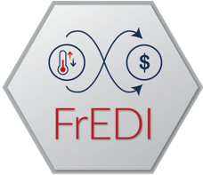

```{r, include = FALSE}
knitr::opts_chunk$set(
    collapse = TRUE,
    comment = "#>",
    fig.path = "man/figures/",
    out.width = "100%"
)
```

```{r setup, include=FALSE}
knitr::opts_chunk$set(echo = TRUE)
```

# FrEDI 

This repository is for FrEDI, the **Framework for Evaluating Damages and Impacts**, developed by the U.S. Environmental Protection Agency (EPA).

FrEDI is an open-source, reduced form model that rapidly projects the impacts of climate change within the United States, under any custom temperature or policy pathway. 

FrEDI was developed to fill an important gap in assessing U.S. climate change impacts by incorporating a broad range of impact studies into a common, open-source framework. This allows FrEDI to facilitate comparability across impact studies, with the flexibility of facilitating custom scenario analyses. 

FrEDI is continually developed and currently draws upon over 30 existing peer-reviewed studies, including from the [Climate Change Impacts and Risk Analysis (CIRA)](https://www.epa.gov/cira/) project, to estimate the relationship between future degrees of warming and impacts across more than 20 category sectors, 48 U.S. states plus the District of Columbia, and population groups. When supplied with a user-defined temperature trajectory, FrEDI then applies these temperature-impact relationships to rapidly project annual climate change impacts and damages through the end of the 21st century (optionally through the year 2300).
<br>


**Recommended Citation:** EPA 2024. Technical Documentation for the Framework for Evaluating Damages and Impacts (FrEDI). U.S. Environmental Protection Agency, EPA 430-R-24-001. Available at: https://www.epa.gov/cira/fredi.

---
<font size="2"> 
_**EPA Disclaimer**_

*The United States Environmental Protection Agency (EPA) GitHub project code is provided on an "as is" basis and the user assumes responsibility for its use. EPA has relinquished control of the information and no longer has responsibility to protect the integrity, confidentiality, or availability of the information. Any reference to specific commercial products, processes, or services by service mark, trademark, manufacturer, or otherwise, does not constitute or imply their endorsement, recommendation or favoring by EPA. The EPA seal and logo shall not be used in any manner to imply endorsement of any commercial product or activity by EPA or the United States Government.*

*By submitting a pull request to the GitHub and/or by installing this package, you make an agreement with EPA that you will not submit a claim of compensation for services rendered to EPA or any other federal agency. Further, you agree not to charge the time you spend developing software code related to this project to any federal grant or cooperative agreement.*
</font>
